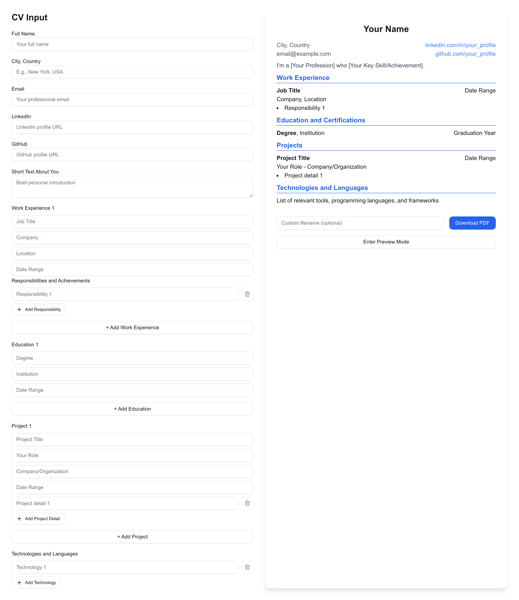

# Next.js CV Generator

  <div align="center">
    
    
    
  </div>



- **Live site**: https://nextjs-cv-generator.vercel.app/

## Project Overview

This Next.js CV Generator is a modern, responsive web application that allows users to create professional CVs quickly and easily. It demonstrates proficiency in React, Next.js, TypeScript, and Tailwind CSS, as well as showcasing skills in form handling, state management, and PDF generation.

## Key Features

1. **Interactive CV Builder**: Users can input their personal information, work experience, education, projects, and technical skills through a user-friendly interface.

2. **Real-time Preview**: As users input their information, they can see a live preview of their CV, allowing for immediate visual feedback.

3. **PDF Generation**: The application can generate a professionally formatted PDF of the CV, ready for download and sharing.

4. **Responsive Design**: Built with Tailwind CSS, the application is fully responsive and works seamlessly on desktop and mobile devices.

5. **TypeScript Integration**: The entire project is written in TypeScript, ensuring type safety and improved developer experience.

## Technical Highlights

- **Next.js Framework**: Utilizes the latest features of Next.js for optimal performance and SEO.
- **React Hooks**: Demonstrates proficient use of React hooks for state management and side effects.
- **Custom Components**: Showcases the ability to create reusable, modular components.
- **Form Handling**: Implements complex form logic with multiple sections and dynamic fields.
- **PDF Generation**: Integrates the html2pdf.js library for client-side PDF creation.
- **Tailwind CSS**: Utilizes Tailwind for efficient and responsive styling.

## Code Snippets

### CV Preview Component

The CvPreview component demonstrates the ability to create a complex, data-driven UI:

```typescript
const CvPreview = React.forwardRef<HTMLDivElement, CvPreviewProps>(({ cvData }, ref) => {
return (
<div ref={ref} className="space-y-2">
<div className="flex flex-col items-center">
<h1 className="text-2xl font-bold mb-4">{cvData.fullName || 'Your Name'}</h1>
<div className="w-full flex justify-between items-start">
<div>
<p className="text-gray-600">{cvData.location || 'City, Country'}</p>
<p className="text-gray-600">{cvData.email || 'email@example.com'}</p>
</div>
<div className="text-right">
<a href={cvData.linkedin} className="text-blue-500 block">{cvData.linkedin ? 'LinkedIn' : 'linkedin.com/in/your_profile'}</a>
<a href={cvData.github} className="text-blue-500 block">{cvData.github ? 'GitHub' : 'github.com/your_profile'}</a>
</div>
</div>
</div>
{/ ... (rest of the component) ... /}
</div>
)
```

### Dynamic Form Handling

The CvTemplateGenerator component showcases advanced state management and form handling:

```typescript
export default function CvTemplateGenerator() {
const [cvData, setCvData] = useState<CvData>({
fullName: '',
location: '',
email: '',
linkedin: '',
github: '',
about: '',
workExperience: [{ title: '', company: '', location: '', date: '', responsibilities: [''] }],
education: [{ degree: '', institution: '', date: '' }],
projects: [{ title: '', role: '', company: '', date: '', details: [''] }],
technologies: ['']
})
// ... (rest of the component) ...
const handleInputChange = (
field: keyof CvData,
value: string,
index?: number,
subfield?: string,
subIndex?: number
) => {
// ... (implementation details) ...
}
// ... (other methods and JSX) ...
}

```

## Running the Project

To run this project locally:

1. Clone the repository
2. Install dependencies: `npm install`
3. Run the development server: `npm run dev`
4. Open [http://localhost:3000](http://localhost:3000) in your browser

## Conclusion

This CV Generator project demonstrates a strong understanding of modern web development practices, including React, Next.js, TypeScript, and responsive design. It showcases the ability to create a fully functional, user-friendly application that solves a real-world problem.